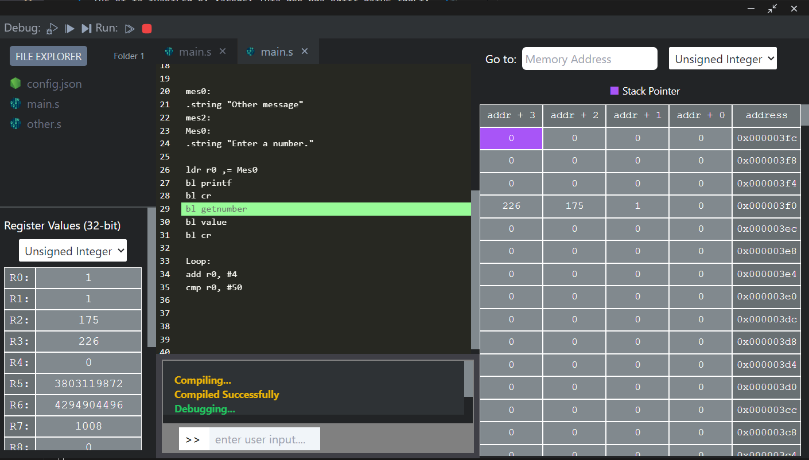

# ARMv7 Assembly IDE Emulator

A simple code editor that is able to run and debug Arm7 assembly code. The UI is inspired by VsCode. This app was built using tauri. The front end uses NextJs (a React Framework) and the backend is written in Rust. The user can run multiple files by adding a config.json file, and putting the files they want to run in the 'files' parameter. If there is no config.json file detected, the editor will automatically look for a main.s file to run. An example of code that can be ran in the editor is inside the folder [example](https://github.com/DashCampbell/Arm-Assembly-Compiler-Simulator/tree/master/example). Special thanks to this [blog](https://hackernoon.com/how-i-cloned-a-simple-vscode-using-tauri-and-reactjs) for creating the basic foundation of this app.
## Getting Started
```bash
npm run tauri dev
```
## Features
* A simple editor UI.
* Ability to edit multiple files.
* Ability to run several Arm instructions.
* Basic debug features like continue, step, and stop buttons.
* CPU and Memory tabs to display the status of the virtual CPU and Memory in real time.
* Ability to compile and run multiple files.
* An integrated terminal to support input and output.
* Predefined subroutines to handle output and user input.

## Running/Debugging Multiple Files:
Create a config.json file in the parent directory. Inside the file, add these two parameters.
```json
{
  "files": [
    "main.s",
    "file2.s",
    "file3.s"
  ],
  "delay": 0
}
```
The 'delay' parameter sets the time delay for each assembly instruction when debugging the code.
## (Frontend) Potential Improvements:
* Improving the frontend performance.
    * Convert some states into references instead.
    * Use a State Machine instead of useContext() to store global variables.

## (Backend) Potential Improvements
* (Top Priority) Adding more instructions, such as:
    * PUSH and POP instructions.
    * ASR
    * BFC
    * BFI
    * CBNZ
    * CBZ
    * And many more.
* Adding more documentation (this is particularly needed in the [utils.rs](https://github.com/DashCampbell/Arm-Assembly-Compiler-Simulator/blob/master/src-tauri/src/utils.rs) module).
* Adding a CodeMirror theme for assembly. So that there is syntax highlighting and maybe linting.
* Add more error handling for file management.
* More robust file management.
### Adding Instructions
All instructions are defined inside the [instructions.rs](https://github.com/DashCampbell/Arm-Assembly-Compiler-Simulator/blob/master/src-tauri/src/instructions.rs) file.
1. First create a struct with the name of the mnemonic, and implement the trait 'Instruction' for it.
    ```rust
    pub trait Instruction: Send + Sync {
        /// The instruction's mnemonic, must be lowercase for text parsing.
        fn mnemonic(&self) -> &'static str;
        /// Determines & validates the operands for an instruction line. Returns an error if the instruction is invalid.
        /// Called at compile time
        /// The extension if used to validate the instruction and get any constraints.
        fn get_operands(
            &self,
            extension: &MnemonicExtension,
            line: &str,
        ) -> Result<Operands, Vec<String>>;
        /// Returns Ok() if instruction executed correctly, returns Err() if there is a runtime error.
        /// Called at runtime.
        fn execute(
            &self,
            s_suffix: bool,
            operands: &Operands,
            chip: &mut Processor,
        ) -> Result<(), String>;
    }
    ```
    Several structs already have the trait, and can be used as examples for how to implement the trait.
2. After adding the trait, inside of the all_instructions() function found [here](https://github.com/DashCampbell/Arm-Assembly-Compiler-Simulator/blob/master/src-tauri/src/instructions.rs), insert the new instruction into the Hashmap.
    ```rust
    /// Returns a Hashmap for all instructions, the key is the instruction's mnemonic
    pub fn all_instructions() -> HashMap<String, Box<dyn Instruction>> {
        let mut instructions: HashMap<String, Box<dyn Instruction>> = HashMap::new();
        instructions.insert("lowercase mnemonic", Box::new(New_Instruction {}));
        
        ...
    }
    ```
